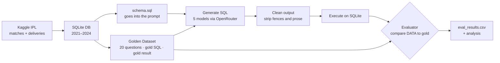
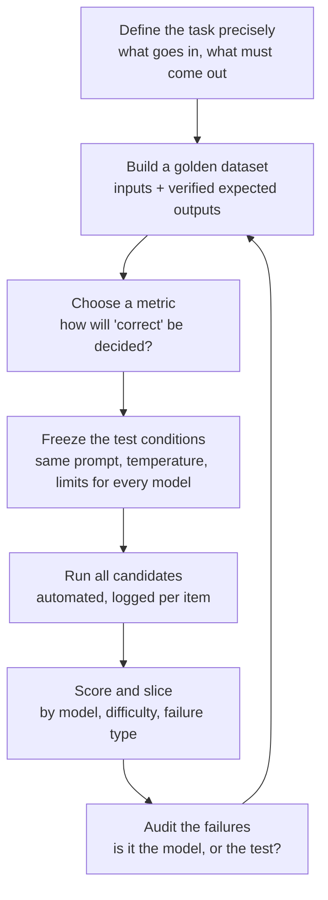
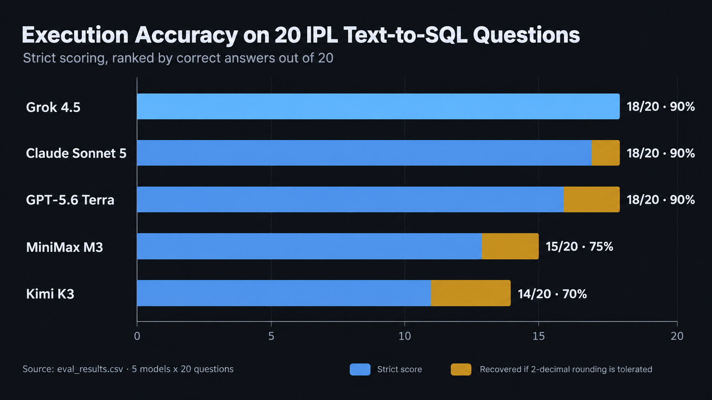
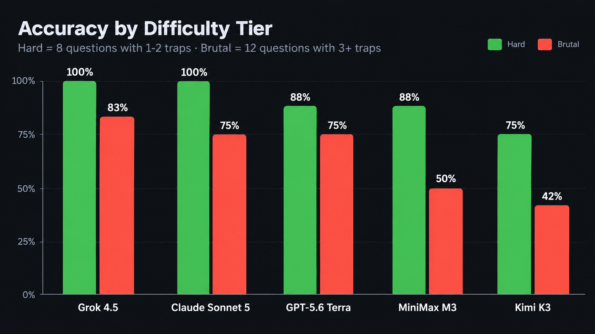
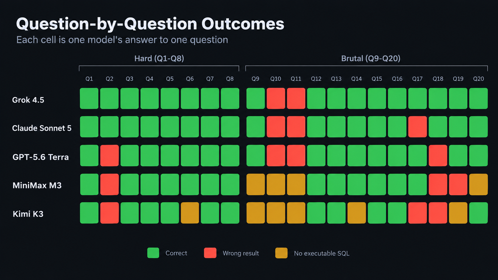
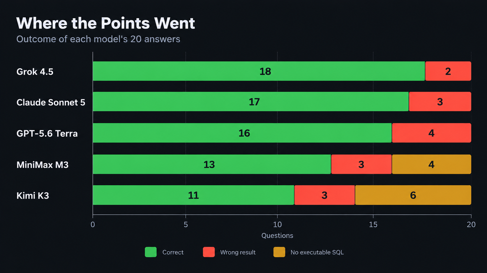

<div align="center">

# IPL Text-to-SQL: LLM Evaluation Harness

**A custom evaluation framework for selecting the language model behind a natural-language IPL query feature**


[Problem](#1-the-problem) · [Approach](#2-the-approach) · [Custom Evals](#3-how-custom-evals-work) · [Harness](#4-our-harness-in-detail) · [Results](#5-results) · [Findings](#6-what-the-data-taught-us) · [Recommendation](#7-recommendation) · [Usage](#8-running-the-harness)

</div>

---

## 1. The Problem

> **Feature request:** *"A user should be able to ask any question related to the IPL. The model converts the question into a SQL query, which is then executed to answer it."*

```
 User:  "Who has the best economy rate among bowlers with 1000+ legal balls?"
   │
   ▼
 LLM  →  SELECT bowler, 6.0*SUM(total_runs)/COUNT(*) ... GROUP BY bowler HAVING ...
   │
   ▼
 SQLite  →  | SP Narine | 6.76 |
   │
   ▼
 Answer shown to user
```

This is called **Text-to-SQL**, and it carries a critical risk: **a query that looks perfect can silently return the wrong number.** Forget to exclude wides from the ball count and every strike rate is wrong. Use `extras_type != 'wides'` without handling `NULL` and half the table disappears. The user sees a confident answer and has no way to know.

So the selection criterion can't be "which model writes nicer SQL" or "which model tops a public leaderboard." It has to be:

> **Given *our* schema and *our* kinds of questions, which model returns the correct data most often?**

That is a question only a **custom eval** can answer.

---

## 2. The Approach



**The core idea: execution accuracy.** We never compare SQL text. Two very different queries can be equally correct, and two near-identical queries can return different answers. Instead we **run the model's SQL against the real database and compare the returned rows to a pre-computed "gold" result.**

---

## 3. How Custom Evals Work

Off-the-shelf benchmarks measure *general* ability. A custom eval measures *fitness for your job*. Every good custom eval, whatever the domain, follows the same loop:



### Step by step

| # | Step | What it means | In this project |
|:-:|---|---|---|
| 1 | **Define the task** | Exact input and output contract | NL question + schema → one SQLite `SELECT` |
| 2 | **Build the golden set** | Cases with *verified* answers, covering the failure modes you care about | 20 questions with hand-written gold SQL; gold **results** are computed by running that SQL |
| 3 | **Pick a metric** | Deterministic where possible, judged where not | Execution accuracy (deterministic) |
| 4 | **Freeze conditions** | Anything that varies between models contaminates the comparison | Same prompt, `temperature=0`, `max_tokens=800`, same schema |
| 5 | **Run at scale** | Automate; log raw output so nothing is lost | `main.py` loops models × questions, saves every SQL |
| 6 | **Score and slice** | A single number hides the story | Accuracy by tier, by question, by failure reason |
| 7 | **Audit failures** | Read the misses. Sometimes the *test* is wrong | This is where we found the rounding and gold-set issues |

### Choosing a metric: the menu

| Metric | How it works | Good for | Weakness |
|---|---|---|---|
| **Exact match** | Output string equals reference | Classification, short answers | Brittle: rejects valid alternatives |
| **Execution accuracy** ✅ | Run the output, compare the *result* | SQL, code with tests, anything executable | Needs a runnable environment and a well-built gold set |
| **Unit-test pass rate** | Run hidden tests on generated code | Code generation | Test quality caps eval quality |
| **LLM-as-judge** | A strong model grades the output against a rubric | Open-ended text, summaries, tone | Judge bias, cost, drift; needs calibration |
| **Human review** | Experts rate outputs | Final validation, subjective quality | Slow, expensive, inconsistent |
| **Pairwise / Elo** | Humans or judges pick the better of two | Overall "feel", chat quality | Hard to attribute *why* |

For Text-to-SQL, execution accuracy is the gold standard because it measures what the user actually experiences: **the number on the screen.**

### The tooling landscape

You can build a harness from scratch (as we did, a few hundred lines of Python) or lean on a framework. Here is the map:

| Tool | Best for |
|---|---|
| **[OpenAI Evals](https://github.com/openai/evals)** | Registry-style evals and templates for prompt/model comparison |
| **[EleutherAI lm-evaluation-harness](https://github.com/EleutherAI/lm-evaluation-harness)** | Running standard academic benchmarks across many models |
| **[Inspect AI](https://inspect.aisi.org.uk/)** | Rigorous, extensible eval framework with solvers, scorers, and sandboxing |
| **[promptfoo](https://www.promptfoo.dev/)** | Fast, config-driven prompt and model comparison with assertions; CI-friendly |
| **[DeepEval](https://github.com/confident-ai/deepeval)** | Pytest-style LLM unit tests with built-in metrics (incl. LLM-as-judge) |
| **[Ragas](https://github.com/explodinggradients/ragas)** | Evaluating RAG pipelines (faithfulness, context relevance) |
| **[LangSmith](https://www.langchain.com/langsmith)** | Tracing + dataset-driven evals for LangChain apps |
| **[Braintrust](https://www.braintrust.dev/)** | Hosted experiment tracking, scoring, and comparison |
| **[Arize Phoenix](https://github.com/Arize-ai/phoenix)** | Open-source observability and evals |
| **[Stanford HELM](https://crfm.stanford.edu/helm/)** | Holistic, multi-metric public benchmarks |
| **[Spider](https://yale-lily.github.io/spider) / [BIRD](https://bird-bench.github.io/)** | Public Text-to-SQL benchmarks: great reference points, but not *your* schema |

> **Why we built our own:** Text-to-SQL scoring needs a live database, custom value-comparison rules, and a golden set that mirrors our exact schema quirks. A small purpose-built harness gave us full control and full transparency, and it's small enough to read end-to-end in one sitting.

---

## 4. Our Harness in Detail

### 4.1 The data

Built from the Kaggle "IPL complete dataset" and filtered to **2021–2024 by match date** (the `season` column is messy, with values like `2020/21`, so dates are the safe filter).

| Table | Rows | Purpose |
|---|---:|---|
| `matches` | **279** | One row per match: teams, venue, toss, winner, margin, player of the match, umpires |
| `deliveries` | **67,303** | One row per ball: batter, bowler, runs, extras, wicket, dismissal kind |

Season split: 2021 (60) · 2022 (74) · 2023 (74) · 2024 (71). The two tables link via `deliveries.match_id → matches.id`, indexed, and `db.py` verifies zero orphan deliveries.

### 4.2 The golden dataset: designed to expose weaknesses

The 20 questions aren't "who scored the most runs?" They're **trap-laden** on purpose, because easy questions saturate and tell you nothing. Each question was written with a gold SQL, executed, and its result frozen as the answer key.

| Tier | Questions | Traps per question | Example |
|---|:---:|---|---|
| **Hard** | Q1–Q8 (8) | 1–2 | *"Which bowler bowled the most legal deliveries?"* → must exclude wides and no-balls **and** handle `NULL` extras |
| **Brutal** | Q9–Q20 (12) | 3+ | *"Best bowling average among bowlers with 30+ wickets, excluding run outs, retired hurt…"* → ratio + `HAVING` + dismissal filtering |

**The trap vocabulary** (what actually separates models):

- `NULL`-sensitive filtering: `extras_type != 'wides'` silently drops every `NULL` row
- Rates and ratios: strike rate, economy, average, percentages
- `HAVING` thresholds: minimum balls, minimum innings, minimum wickets
- Legal-ball counting: wides and no-balls don't count, byes and leg-byes do
- Wicket attribution: run outs aren't the bowler's wicket
- Multi-level subqueries, CTEs, and window functions (`RANK() OVER PARTITION`)
- Self-referential team logic: `team1` / `team2` / `winner`, and "who batted second?"
- Phase logic: powerplay (overs 0–5), death overs (15–19)

### 4.3 The prompt: identical for every model

```text
SYSTEM: You are a text-to-SQL generator. Given a database schema and a question,
        return a single SQL query that answers it. Use SQLite syntax.
        Return only the SQL query.

USER:   Schema:
        <full CREATE TABLE statements from schema.sql>

        Question: <question>

        SQL:
```

Zero-shot. No examples, no hints, no domain notes. If a model wants to know that "legal balls exclude wides," it has to already know, or work it out from the question.

| Setting | Value | Why |
|---|---|---|
| `temperature` | `0` | Reproducibility |
| `max_tokens` | `800` | SQL is short; also avoids credit-reservation errors |
| Access layer | LangChain `ChatOpenRouter` | One interface, five vendors |

### 4.4 The pipeline (`main.py`)

```
for each model:
    for each golden question:
        1. generate_sql()   → prompt the model
        2. clean_sql()      → strip ```sql fences, prose, trailing semicolons
        3. run_sql()        → execute on SQLite  (failure → reason = "sql_error")
        4. evaluate_one()   → compare returned rows to the gold result
        5. log              → model, id, difficulty, correct, reason, sql
```

Every raw SQL is saved to `eval_results.csv`, so any score can be audited after the fact.

### 4.5 The evaluator: value-based and deliberately forgiving about *format*

Judging correctness by data, not by text, needs some care. `evaluator.py` handles this:

| Rule | Rationale |
|---|---|
| ✅ **Column names ignored** | `economy` vs `econ_rate` shouldn't matter |
| ✅ **Row order ignored** (unless `order_sensitive`) | Only Q12 ("ordered by season") is order-sensitive |
| ✅ **Numbers compared numerically** | `24395` equals `24395.0` |
| ✅ **Float noise tolerated** | Rounded to 4 decimal places before comparison |
| ✅ **±1 column allowed** ("Path A") | "Who scored the most?" is right whether it returns the name alone or name + count |
| ❌ **Row count must match** | Returning 3 rows for a 1-row answer is wrong |
| ❌ **Values must match** | This is the whole point |

Each answer gets exactly one verdict: `match`, `mismatch`, or `sql_error` (the query didn't run, or there was no query).

### 4.6 The contenders

| Display name | OpenRouter slug |
|---|---|
| GPT-5.6 Terra | `openai/gpt-5.6-terra-pro` |
| Kimi K3 | `moonshotai/kimi-k3` |
| Grok 4.5 | `x-ai/grok-4.5` |
| Claude Sonnet 5 | `anthropic/claude-sonnet-5` |
| MiniMax M3 | `minimax/minimax-m3` |

---

## 5. Results

100 generations (5 models × 20 questions): **75 correct · 15 wrong result · 10 no executable SQL.**

### Summary

Five models were each asked to write SQL for the same 20 questions (100 generations in total). Grok 4.5 scored highest under strict scoring, followed by Claude Sonnet 5 and GPT-5.6 Terra, with MiniMax M3 and Kimi K3 further behind.

> **Reading the ranking:** with only 20 questions, the top three are statistically hard to separate (95% intervals overlap heavily), and we found that **8 of the 15 wrong answers were caused by rounding, not by wrong logic**. Once rounding is tolerated, the top three converge at 90%. The big, real gap is between the top three and the bottom two, and most of *that* gap is models returning **no SQL at all**. Details in [Section 6](#6-what-the-data-taught-us).

<div align="center">

</div>

### 5.1 Leaderboard

| Model | Correct | Wrong result | No SQL | Strict accuracy | 95% interval* |
|---|:---:|:---:|:---:|:---:|:---:|
| **Grok 4.5** | 18 | 2 | 0 | **90%** | 70–97% |
| **Claude Sonnet 5** | 17 | 3 | 0 | **85%** | 64–95% |
| **GPT-5.6 Terra** | 16 | 4 | 0 | **80%** | 58–92% |
| **MiniMax M3** | 13 | 3 | 4 | **65%** | 43–82% |
| **Kimi K3** | 11 | 3 | 6 | **55%** | 34–74% |

<sub>*Wilson score interval on 20 trials. Wide intervals are the honest cost of a small golden set.</sub>

### 5.2 Difficulty breakdown

<div align="center">

</div>
<div></div>

| Model | Hard (8) | Brutal (12) | Drop-off |
|---|:---:|:---:|:---:|
| Grok 4.5 | 8/8 (100%) | 10/12 (83%) | −17 pts |
| Claude Sonnet 5 | 8/8 (100%) | 9/12 (75%) | −25 pts |
| GPT-5.6 Terra | 7/8 (88%) | 9/12 (75%) | −13 pts |
| MiniMax M3 | 7/8 (88%) | 6/12 (50%) | −38 pts |
| Kimi K3 | 6/8 (75%) | 5/12 (42%) | −33 pts |

### 5.3 Question-by-question

<div align="center">

</div>

- **10 of 20 questions were solved by all five models**: Q1, Q3, Q4, Q5, Q7, Q8, Q12, Q13, Q15, Q16. Window functions (Q12) and nested subqueries (Q16) were *not* where models struggled.
- **Q10 and Q11 were solved by no model.** They're the two most informative questions in the set. See [§6.2](#62-the-q10q11-mystery-every-model-failed-and-probably-for-a-good-reason).
- **Q9 (strike rate) separated the field**: Grok, Claude, and GPT got it right; Kimi and MiniMax returned nothing.

### 5.4 Where the points went

<div align="center">

</div>

---

## 6. What the Data Taught Us

The ranking is the least interesting part of this eval. The **failure analysis** is where the value is.

### 6.1 Rounding cost models 8 points; the evaluator's tolerance is 4 decimals

Eight "wrong" answers returned the *right* result rounded to 2 decimal places, e.g. `80.06` where the gold has `80.0623…`. Our evaluator rounds to 4 decimals, so these count as mismatches. We re-executed every mismatched query and re-scored with a 2-decimal tolerance:

| Model | Strict | Rounding-tolerant | Recovered |
|---|:---:|:---:|:---:|
| Grok 4.5 | 18 (90%) | 18 (90%) | 0 |
| Claude Sonnet 5 | 17 (85%) | 18 (90%) | +1 (Q17) |
| GPT-5.6 Terra | 16 (80%) | 18 (90%) | +2 (Q2, Q18) |
| MiniMax M3 | 13 (65%) | 15 (75%) | +2 (Q2, Q18) |
| Kimi K3 | 11 (55%) | 14 (70%) | +3 (Q2, Q17, Q18) |

Grok never used `ROUND()` in any of its 20 queries; the other four did. **Whether that's a flaw depends on your product:** if the SQL result is shown directly to users, over-rounding is arguably *better*; if it feeds further computation, it's a hazard. It's a decision to make consciously, and the eval surfaced it.

> The **official scores throughout this README use the original strict evaluator** so every number is reproducible from `eval_results.csv`. The rounding-tolerant column is a sensitivity analysis, not a replacement.

### 6.2 The Q10/Q11 mystery: every model failed, and probably for a good reason

Q10 (best economy rate) and Q11 (best bowling average) were missed by **every model that produced SQL**. When independent models all fail the same question, suspect the answer key.

The gold SQL computes "runs conceded" as `SUM(total_runs)`, which **includes byes and leg-byes**. In real cricket, byes and leg-byes are *not* charged to the bowler; wides and no-balls are. The models knew this.

| Q11: Best bowling average | Answer |
|---|---|
| **Gold** (`total_runs`) | AD Russell, **17.56** |
| GPT-5.6 Terra | AD Russell, **17.28** |
| Grok 4.5 | AD Russell, **17.28** |
| Claude Sonnet 5 | AD Russell, **17.28** |

Three models, three different SQL constructions, **the same number, all disagreeing with the gold**, and all applying the actual rules of the game. The models were right about cricket; the golden set was arguably too literal.

**This is exactly what step 7 of a custom eval is for.** It doesn't change the official scores, but it flags Q10 and Q11 for revision, and it means the real-world ceiling for these models is higher than 90%.

### 6.3 Most losses for the bottom two were empty outputs, not wrong logic

| | Kimi K3 | MiniMax M3 |
|---|:---:|:---:|
| Wrong result | 3 | 3 |
| **No SQL returned** | **6** | **4** |

Nine of the ten `sql_error` rows are **completely empty outputs**; the tenth (Kimi, Q6) is SQL **truncated mid-identifier** at `fi.match`. Every one landed on a brutal question except Q6, and the pattern is consistent with reasoning-style models spending the `max_tokens=800` budget on internal thinking before emitting a query.

> **Note:** this is a **hypothesis consistent with the evidence**, not a verified cause: we didn't inspect the raw responses. But it matters: **when a model *does* return SQL, Kimi and MiniMax are competitive** (Kimi: 11 of 14 delivered queries correct; MiniMax: 13 of 16). A rerun with a larger token budget is the first thing to try before writing them off.

### 6.4 Q19 has a five-way tie, and the gold picks one arbitrarily

*"Which bowler dismissed a specific batter the most times?"* Five bowler–batter pairs are tied at 4 dismissals. The gold query uses `LIMIT 1`, so its answer (DL Chahar → Shubman Gill) depends on SQLite's tie ordering. MiniMax returned a *different, equally valid* pair (Harpreet Brar → GJ Maxwell) and was marked wrong. **Fix:** make the gold return all tied rows, or add a deterministic tie-breaker to the question.

### 6.5 Summary of insights

| Insight | Evidence |
|---|---|
| **Complex SQL isn't the hard part anymore.** | All 5 models nailed a window function (Q12) and a nested `NOT IN` subquery (Q16), plus the ratio-and-`HAVING` questions Q13 and Q15 |
| **Domain semantics is the hard part.** | Q10/Q11: cricket rules the schema doesn't encode |
| **Output *hygiene* matters as much as intelligence.** | 2-dp rounding and empty/truncated outputs cost more points than logic errors did |

---

## 7. Recommendation

| If your priority is… | Take-away |
|---|---|
| **Highest strict score today** | **Grok 4.5**: 18/20, never rounds, never failed to return SQL |
| **Strong all-round, near-tied for first** | **Claude Sonnet 5** and **GPT-5.6 Terra**: identical (18/20) once rounding is tolerated |
| **Potential upside with tuning** | **Kimi K3** and **MiniMax M3**: accurate when they respond; fix the token budget and re-test |

**An honest caveat:** the top three sit within one or two questions of each other on a 20-question set, a gap that is *not* statistically meaningful. This eval reliably shows the **top tier (Grok, Claude, GPT) vs. the rest**, but *not* a definitive order within the top tier. It also **didn't measure cost, latency, or consistency across repeated runs**, all of which belong in a production decision. Treat this as strong evidence for a shortlist, then use the roadmap below to settle it.

### Roadmap to a confident decision

- [ ] **Audit the golden set**: fix Q10/Q11 (byes/leg-byes), Q19 (tie-break); consider tolerance-based numeric comparison
- [ ] **Re-run Kimi K3 and MiniMax M3** with a higher `max_tokens` (or disable reasoning) to separate capability from budget
- [ ] **Grow the set to 100+ questions** with realistic *user* phrasing (typos, slang, "Kohli" vs "V Kohli"), not just clean analyst prompts
- [ ] **Run N ≥ 3 trials** per model to measure variance
- [ ] **Track cost per correct answer and p95 latency**
- [ ] **Try the contamination check**: `schema_extractor.py` already supports a renamed schema (`RENAME = True`) so models can't lean on memorised Kaggle column names
- [ ] **Add a self-repair loop** (feed the SQL error back to the model) and measure how much it lifts each model
- [ ] **Add an answer-verbalisation stage** and grade the final English answer, not just the SQL

---

## 8. Running the Harness

### Project structure

```
LLM-Eval-Harness/
├── data/
│   ├── matches.csv                   # raw Kaggle data
│   └── deliveries.csv
├── db.py                             # 1. build ipl_2021_2024.db (filtered by date, indexed, verified)
├── schema_extractor.py               # 2. dump CREATE TABLEs → schema.sql (optional renamed schema)
├── golden_dataset_generator.py       # 3. the 20 questions + gold SQL, with trap annotations
├── make_golden_dataset.py            # 4. execute gold SQL → freeze results into a CSV
├── model_openrouter_slug.py          # the models under test
├── main.py                           # 5. the orchestrator: generate → execute → evaluate → log
├── evaluator.py                      # the scoring logic
├── first_test.py                     # smoke test: one question, one model, raw output
├── golden_dataset.csv                # questions + gold SQL + frozen gold results
├── eval_results.csv                  # every model's SQL and verdict
└── assets/                           # charts used in this README
```

### Quickstart

```bash
# 1. install
pip install langchain-openrouter python-dotenv pandas

# 2. add your key
echo "OPENROUTER_API_KEY=sk-or-..." > .env

# 3. build the database and schema
python db.py
python schema_extractor.py

# 4. build the golden dataset
python make_golden_dataset.py
#    ↳ this writes golden_hard.csv; main.py reads golden_dataset.csv,
#      so rename it (or change GOLDEN_PATH in main.py)

# 5. sanity-check ONE question on ONE model before spending money
python first_test.py

# 6. run the full eval  →  eval_results.csv
python main.py
```

### Add your own model

Edit `model_openrouter_slug.py`. Any model on OpenRouter works:

```python
MODELS = [
    ("My Model", "provider/model-slug"),
    ...
]
```

### Add your own question

Append to `GOLDEN` in `golden_dataset_generator.py`:

```python
dict(id=21, diff="brutal",
     q="Which team hit the most sixes in 2022?",
     sql="""SELECT batting_team, COUNT(*) AS sixes FROM deliveries d
            JOIN matches m ON d.match_id = m.id
            WHERE d.batsman_runs = 6 AND m.season = '2022'
            GROUP BY batting_team ORDER BY sixes DESC LIMIT 1"""),
```

Then re-run `make_golden_dataset.py`. If two teams could tie for first, make the gold return both, or the eval will grade tie-breaking luck ([§6.4](#64-q19-has-a-five-way-tie-and-the-gold-picks-one-arbitrarily)).

---

## Glossary

| Term | Meaning |
|---|---|
| **Golden dataset** | A set of inputs with verified correct outputs, the answer key for the eval |
| **Execution accuracy** | Scoring a query by running it and comparing its *results* to the expected results |
| **Gold SQL / gold result** | The reference query, and the data it returns |
| **Strike rate** | Runs per 100 balls faced (wides don't count as balls faced) |
| **Economy rate** | Runs conceded per over (6 legal balls) |
| **Legal delivery** | Any ball that isn't a wide or a no-ball |
| **Powerplay / death overs** | Overs 1–6 (indexed 0–5 in the data) / overs 16–20 (indexed 15–19) |

---

*Questions, corrections, or additions to the golden dataset are welcome; a stronger answer key makes every future comparison more reliable.*